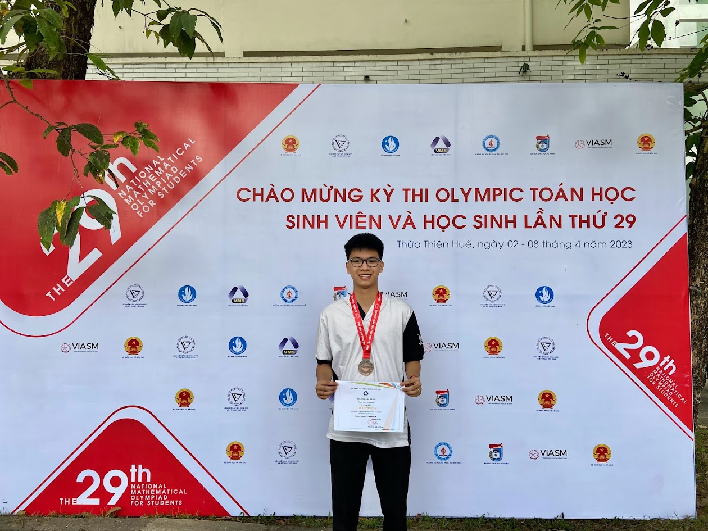

<p align="center"></p>

---
<!-- 
<details>
  <summary>📃 My Resume</summary>

### Education

- 📖 **Information Technology**\
📆 10/2021 - present\
📍 **Thang Long University** - Hoang Mai, Hanoi, Vietnam -->

<!-- ### Experience
- 👨‍💻 **Full Stack Web Intern**\
📆 09/2022 - 12/2023\
📍 **TECH 5S** -  Luu Huu Phuong, Phuong My Dinh I, Nam Tu Liem, Hanoi.


- 👨‍💻 **Full Stack Web Fresher**\
📆 1/2022 - 05/2023\
📍 **TECH 5S** -  Luu Huu Phuong, Phuong My Dinh I, Nam Tu Liem, Hanoi.

- 👨‍💻 **Frontend Web Fresher**\
📆 11/2023 - present\
📍 **White Neuron** -  Mau Luong, Ha Dong, Hanoi, Vietnam
</details> -->

### 📊 All time development breakdown

<!--START_SECTION:waka-->

```txt
From: 22 January 2024 - To: 17 June 2024

Total Time: 288 hrs 45 mins

Python           124 hrs 12 mins ██████████▓░░░░░░░░░░░░░░   43.01 %
TypeScript       114 hrs 1 min   ██████████░░░░░░░░░░░░░░░   39.49 %
JavaScript       20 hrs 24 mins  █▓░░░░░░░░░░░░░░░░░░░░░░░   07.07 %
HTML             10 hrs 17 mins  █░░░░░░░░░░░░░░░░░░░░░░░░   03.56 %
JSON             4 hrs 41 mins   ▒░░░░░░░░░░░░░░░░░░░░░░░░   01.62 %
```

<!--END_SECTION:waka-->
