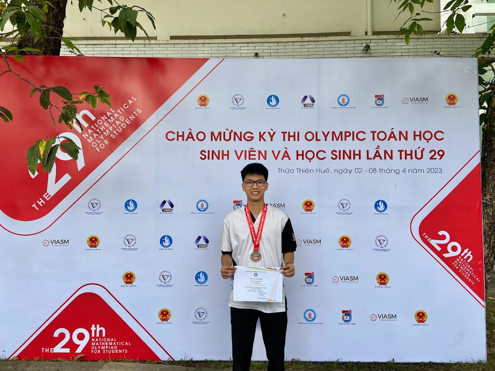

<p align="center"></p>

---

<details>
  <summary>📃 My Resume</summary>

### Education

- 📖 **Information Technology**\
📆 10/2021 - present\
📍 **Thang Long University** - Hoang Mai, Hanoi, Vietnam

### Experience


- 👨‍💻 **Full Stack Web Intern**\
📆 09/2022 - 12/2023\
📍 **TECH 5S** -  Luu Huu Phuong, Phuong My Dinh I, Nam Tu Liem, Hanoi.


- 👨‍💻 **Full Stack Web Fresher**\
📆 1/2022 - 05/2023\
📍 **TECH 5S** -  Luu Huu Phuong, Phuong My Dinh I, Nam Tu Liem, Hanoi.

- 👨‍💻 **Frontend Web Fresher**\
📆 11/2023 - present\
📍 **White Neuron** -  Mau Luong, Ha Dong, Hanoi, Vietnam
</details>

### 📊 All time development breakdown

<!--START_SECTION:waka-->

```txt
From: 22 January 2024 - To: 02 February 2024

Total Time: 33 hrs 22 mins

TypeScript   24 hrs 7 mins   ██████████████████░░░░░░░   72.31 %
Python       6 hrs 10 mins   ████▓░░░░░░░░░░░░░░░░░░░░   18.49 %
HTML         40 mins         ▓░░░░░░░░░░░░░░░░░░░░░░░░   02.03 %
JavaScript   35 mins         ▒░░░░░░░░░░░░░░░░░░░░░░░░   01.76 %
YAML         27 mins         ▒░░░░░░░░░░░░░░░░░░░░░░░░   01.38 %
```

<!--END_SECTION:waka-->
